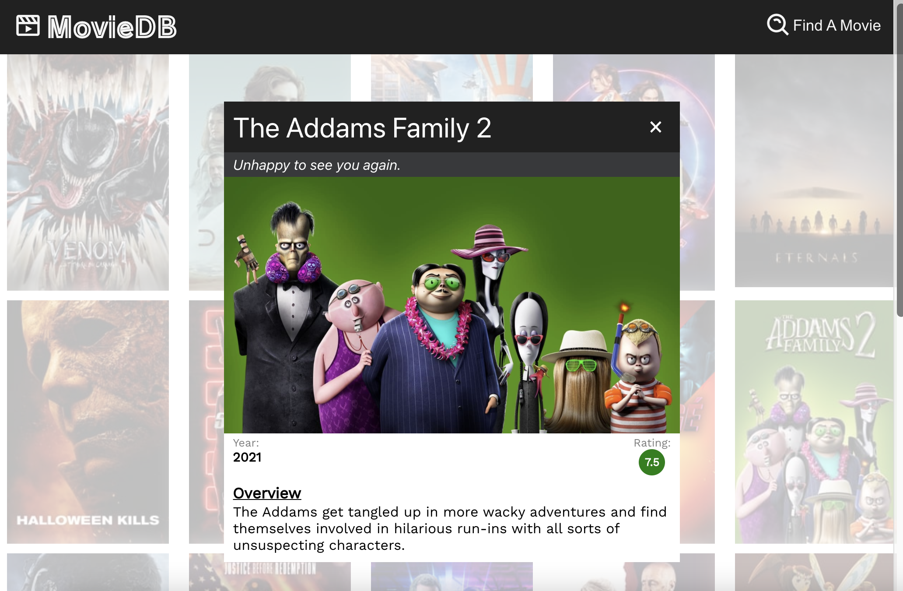
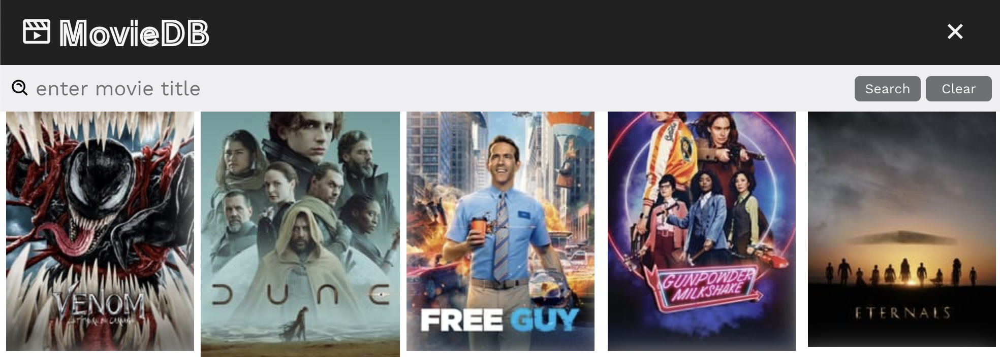

<div id="top"></div>

# MovieDB App


## Table of Contents
1. [About the Project](#about-the-project)
    1. [Built With](#built-with)
2. [Getting Started](#getting-started)
    1. [Installation](#installation)
3. [Usage](#usage)
4. [Contact](#contact)
5. [Acknowledgements](#acknowledgements)

## About the Project
---
A movie database app using the TMDB API that allows you to search for specific movies.

### Built With
* [React.js](https://reactjs.org)
* [Typescript](https://www.typescriptlang.org/)

<p align="right">(<a href="#top">back to top</a>)</p>

## Getting Started
---
### Installation
1. Get a free API key at [https://www.themoviedb.org/](https://www.themoviedb.org/)
2. Clone this repo
```
$ git clone https://github.com/lmnicholls/moviedb.git
```
3. CD into moviedb
``` 
$ cd moviedb
```
4. Install yarn packages
```
$ yarn install
```
5. Enter your API key in a new .env file inside your client folder
```js
REACT_APP_MOVIE_DB_KEY=your_tmdb_api_key_here
```
### How to Start
```
$ yarn start
```

<p align="right">(<a href="#top">back to top</a>)</p>

## Usage
---



<p align="right">(<a href="#top">back to top</a>)</p>

## Contact
---
Lauren Nicholls - lauren.nicholls1@gmail.com

Project Link: [https://github.com/lmnicholls/moviedb](https://github.com/lmnicholls/moviedb)

<p align="right">(<a href="#top">back to top</a>)</p>

## Acknowledgements
---

* [Styled Components](https://styled-components.com/)
* [React Icons](https://react-icons.github.io/react-icons/)
* [React Modal](https://www.npmjs.com/package/react-modal)
* [React Infinite Scroller](https://www.npmjs.com/package/react-infinite-scroller)
* [Axios](https://www.axios.com/)

<p align="right">(<a href="#top">back to top</a>)</p>
